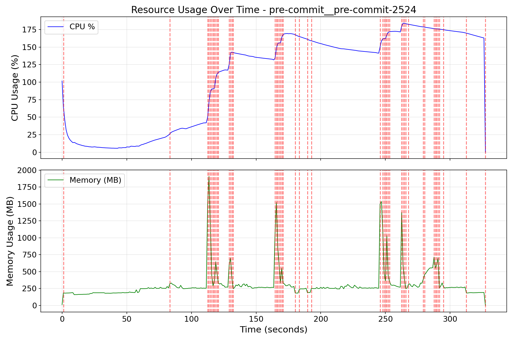
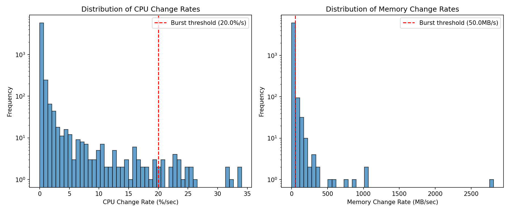
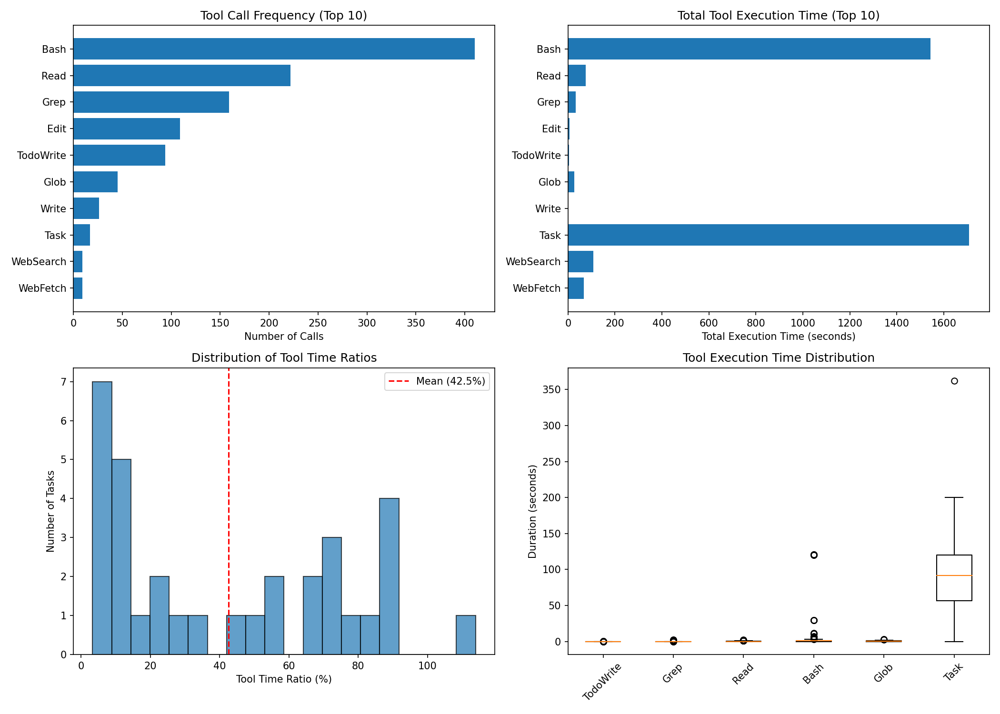
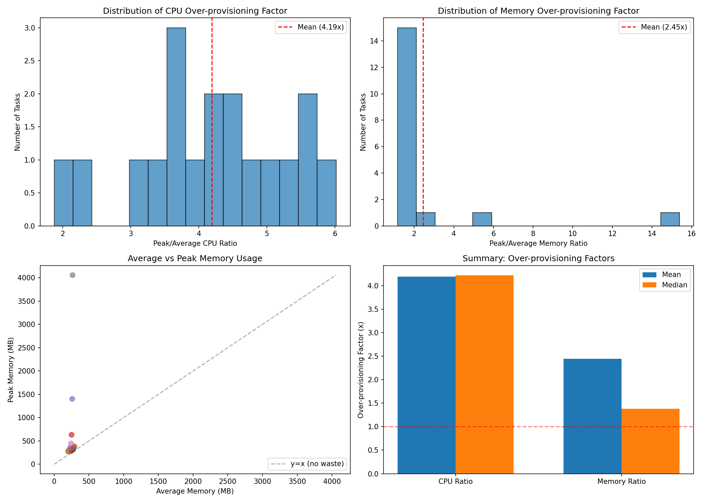

# AgentCgroup SWE-Bench Experiment Analysis Report (haiku)

Generated: 2026-02-06 03:28:55

Data source: `/home/yunwei37/agentcgroup/experiments/batch_swebench_18tasks`

Total tasks analyzed: 18

## Dataset Overview

| Metric | Value |
|--------|-------|
| Total tasks | 18 |
| Successful | 15 (83.3%) |
| Total execution time | 10161.9s (169.4 min) |

## RQ1: Resource Usage Dynamics (Time-scale Mismatch)

**Research Question**: How dynamic are resource changes during AI agent execution?

**Paper Claim**: User-space controllers react in 10-100ms, but resource changes happen at millisecond scale.

### Findings

- **Total burst events detected**: 203
- **Tasks with bursts**: 18 / 18

**CPU Change Rate Statistics (%/sec)**:
- Mean: 0.46
- Max: 34.05
- 95th percentile: 1.12

## RQ2: Resource Usage by Category (Domain Mismatch)

**Research Question**: Do different task categories have significantly different resource needs?

**Paper Claim**: Static resource limits cannot adapt to different workloads.

### Memory Usage by Category

| Category | N | Avg Memory (MB) | Peak Memory (MB) |
|----------|---|-----------------|------------------|
| CLI_Tools | 3 | 236.3 | 452.1 |
| DevOps_Build | 3 | 243.1 | 633.2 |
| ML_Scientific | 3 | 255.8 | 1403.0 |
| Medical_Bio | 3 | 228.3 | 4060.0 |
| SQL_Data | 3 | 261.1 | 392.5 |
| Web_Network | 3 | 237.1 | 308.4 |

## RQ3: Tool Call Patterns

**Research Question**: What is the relationship between tool calls and resource consumption?

### Top Tools by Execution Time

| Tool | Call Count | Total Time (s) | Avg Time (s) |
|------|------------|----------------|--------------|
| Bash | 559 | 1475.65 | 2.64 |
| Task | 19 | 1257.07 | 66.16 |
| TaskOutput | 4 | 210.19 | 52.55 |
| WebFetch | 2 | 9.98 | 4.99 |
| Read | 157 | 9.92 | 0.06 |
| Edit | 76 | 3.35 | 0.04 |
| TodoWrite | 84 | 2.82 | 0.03 |
| Grep | 11 | 0.71 | 0.06 |
| Write | 10 | 0.29 | 0.03 |
| KillShell | 2 | 0.10 | 0.05 |

**Tool Time Ratio**: Mean 37.9%, Median 32.7%

## RQ4: Over-provisioning Analysis

**Research Question**: How much over-provisioning would static limits require?

### Over-provisioning Factors

| Metric | CPU Ratio | Memory Ratio |
|--------|-----------|--------------|
| Mean | 4.19x | 2.45x |
| Median | 4.22x | 1.38x |
| Max | 6.02x | 15.39x |
| 95th Percentile | 5.77x | 6.95x |

## Key Conclusions

1. **Time-scale Mismatch**: Resource usage exhibits significant burstiness that exceeds 
   the reaction time of typical user-space controllers.
2. **Domain Mismatch**: Different task categories show distinct resource profiles, 
   making static limits suboptimal.
3. **Over-provisioning Waste**: Static provisioning at peak levels wastes significant resources,
   as average usage is typically much lower than peak.