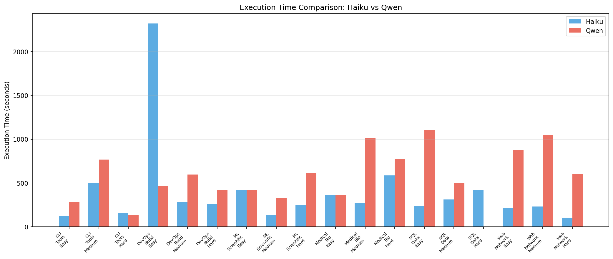
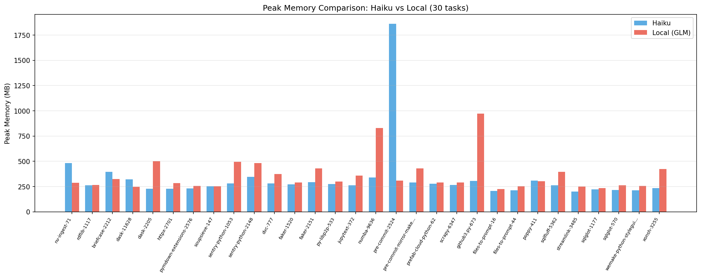
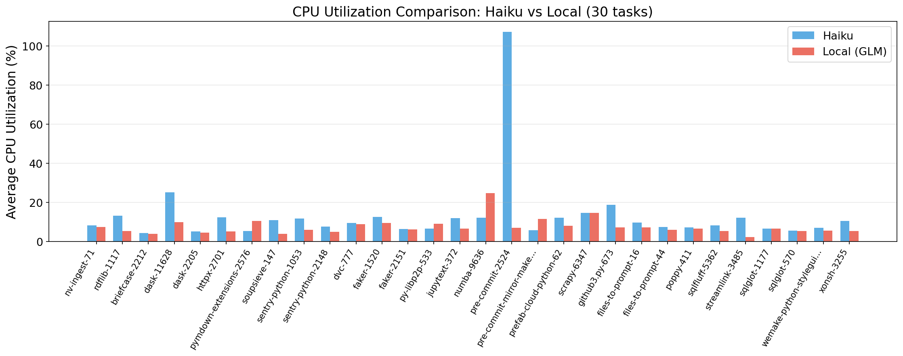
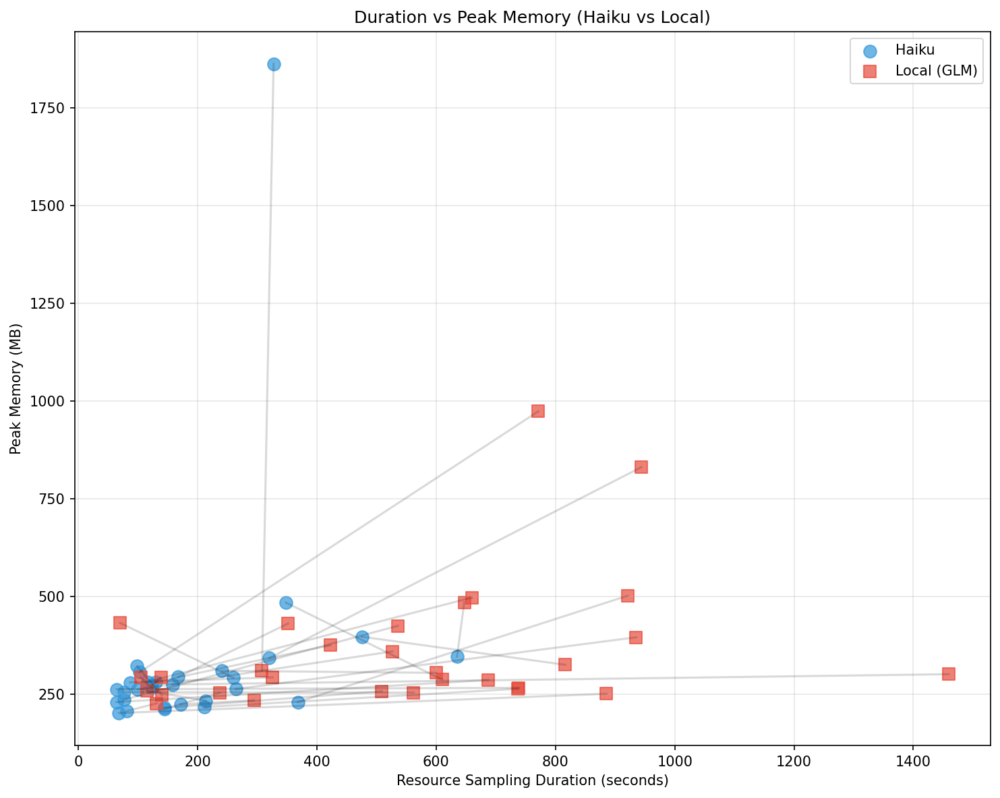
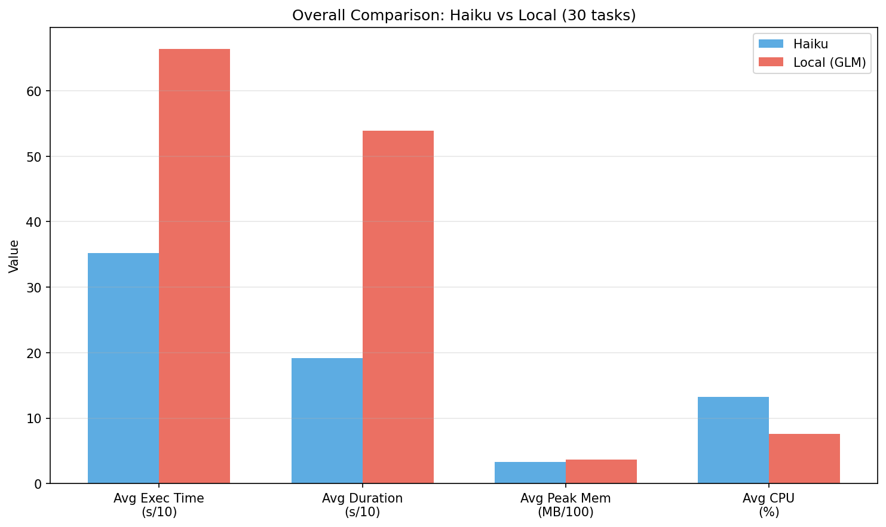

# Haiku vs Qwen 模型对比分析报告

**生成时间**: 2026-02-06 22:29:13

## 概述

本报告对比分析了在相同 18 个 SWE-bench 任务上，Haiku 和 Qwen 两个模型的表现差异。

## 1. 成功率对比

| 指标 | Haiku | Qwen |
|------|-------|------|
| 成功任务数 | 17/18 | 8/18 |
| 成功率 | **94.4%** | 44.4% |
| 两者都成功 | 8/18 | |
| 仅该模型成功 | 9 | 0 |

## 2. 资源使用对比

| 指标 | Haiku | Qwen | 比率 |
|------|-------|------|------|
| 平均执行时间 | 400s | 607s | Qwen 1.52x |
| 平均峰值内存 | 611MB | 463MB | Qwen 0.76x |
| 平均 CPU 利用率 | 30.6% | 7.9% | Haiku 3.9x |

## 3. 任务级详细对比

| 任务 | Haiku | Qwen | H 时间 | Q 时间 | H 内存 | Q 内存 |
|------|-------|------|--------|--------|--------|--------|
| CLI_Tools_Easy | ✅ | ❌ | 123s | 284s | 279MB | 278MB |
| CLI_Tools_Medium | ✅ | ✅ | 498s | 766s | 320MB | 298MB |
| CLI_Tools_Hard | ✅ | ❌ | 154s | 140s | 452MB | 292MB |
| DevOps_Build_Easy | ✅ | ✅ | 2319s | 468s | 633MB | 310MB |
| DevOps_Build_Medium | ✅ | ✅ | 284s | 597s | 352MB | 310MB |
| DevOps_Build_Hard | ✅ | ❌ | 259s | 424s | 316MB | 374MB |
| ML_Scientific_Easy | ✅ | ❌ | 420s | 420s | 1403MB | 1367MB |
| ML_Scientific_Medium | ✅ | ❌ | 138s | 326s | 326MB | 247MB |
| ML_Scientific_Hard | ❌ | ❌ | 250s | 618s | 297MB | 273MB |
| Medical_Bio_Easy | ✅ | ✅ | 361s | 365s | 296MB | 286MB |
| Medical_Bio_Medium | ✅ | ✅ | 277s | 1014s | 348MB | 329MB |
| Medical_Bio_Hard | ✅ | ❌ | 585s | 776s | 4060MB | 2041MB |
| SQL_Data_Easy | ✅ | ❌ | 240s | 1106s | 392MB | 395MB |
| SQL_Data_Medium | ✅ | ❌ | 313s | 499s | 287MB | 234MB |
| SQL_Data_Hard | ✅ | ❌ | 422s | N/A | 336MB | N/A |
| Web_Network_Easy | ✅ | ✅ | 212s | 875s | 308MB | 286MB |
| Web_Network_Medium | ✅ | ✅ | 231s | 1048s | 297MB | 250MB |
| Web_Network_Hard | ✅ | ✅ | 106s | 603s | 291MB | 294MB |

## 4. 按类别分析

| 类别 | Haiku 成功 | Qwen 成功 |
|------|------------|-----------|
| CLI_Tools | 3/3 | 1/3 |
| DevOps_Build | 3/3 | 2/3 |
| ML_Scientific | 2/3 | 0/3 |
| Medical_Bio | 3/3 | 2/3 |
| SQL_Data | 3/3 | 0/3 |
| Web_Network | 3/3 | 3/3 |

## 5. 按难度分析

| 难度 | Haiku 成功 | Qwen 成功 |
|------|------------|-----------|
| Easy | 6/6 | 3/6 |
| Medium | 6/6 | 4/6 |
| Hard | 5/6 | 1/6 |

## 6. 关键发现

### 成功率差异
- **Haiku 显著优于 Qwen**: 成功率 94.4% vs 44.4%
- Haiku 在所有 Qwen 成功的任务上都成功
- Haiku 额外成功了 9 个 Qwen 失败的任务

### 资源使用模式差异
1. **执行时间**: Qwen 平均耗时是 Haiku 的 **1.52 倍**
2. **内存使用**: Haiku 峰值内存略高 (611MB vs 463MB)
3. **CPU 利用率**: Haiku 明显更高 (30.6% vs 7.9%)

### 对论文的启示
- 不同模型在相同任务上表现出显著不同的资源使用模式
- 这进一步支持了**域不匹配**的论点：即使相同任务，不同"执行者"也需要不同资源
- CPU 利用率差异达 **3.9x**，说明静态限制无法适应多样化工作负载

